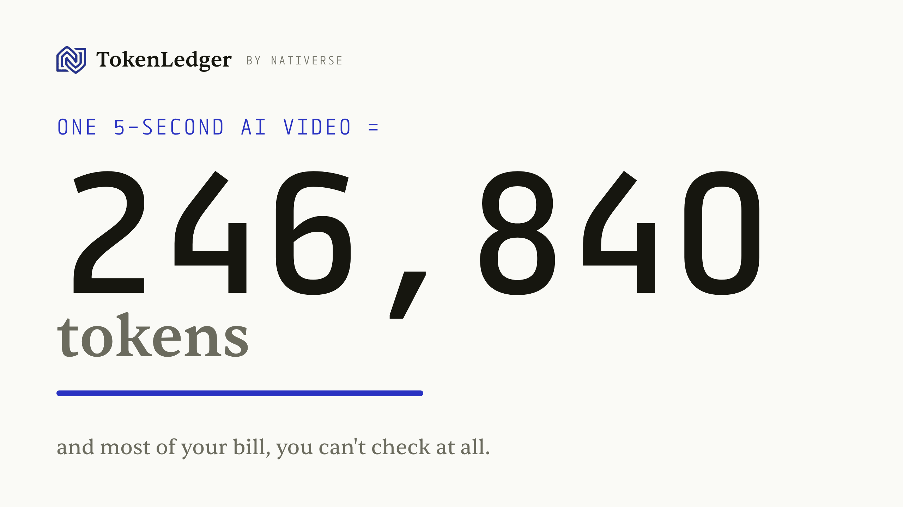

<div align="center">



# TokenLedger

**See how much of your AI bill is actually checkable — and how much you pay on pure trust. Every figure labelled EXACT, BOUNDED, or UNVERIFIABLE.**

[](LICENSE)
[](pyproject.toml)
[](#design-principles)

[Website](https://tokenledger.nativerse-ventures.com) · by [Nativerse](https://nativerse-ventures.com)

</div>

---

Providers self-report token usage and bill you on it. Some of that bill can be checked against what
you actually received; most of it — reasoning and cache tokens you never see — cannot be checked by
anyone. TokenLedger re-counts the output you received, reconciles it against the reported usage, and
above all tells you **how much of your bill has any ground truth at all**, labelling every figure
EXACT, BOUNDED, or UNVERIFIABLE. Self-hosted — no prompt or response content leaves your machine.

> **What this is, and is not.** Re-counting the output is a *consistency check* that binds the bill to
> the artifact you received — it catches substitution and metering bugs, but it is **not** an
> independent measure of whether your true cost is fair. The genuine value is measuring the
> unverifiable share. See [docs/known-limitations.md](docs/known-limitations.md).

## See it in action


> Two real BytePlus (Seedance) video bills, re-derived from the delivered files. Video tokens follow
> `(width × height / 1024) × frames`, so re-deriving the count (246,840 and 108,900, gap 0) is a
> **consistency check**: it binds the bill to the file you received and would catch a 1080p-billed /
> 480p-delivered swap, but a matching number is what an honest provider always produces. The figure
> that should worry you is the **unverifiable majority** — reasoning and cache — that no method can
> check. Reproduce: `examples/byteplus_validation.py`.

## What it can and cannot check

| Bucket | Confidence | How |
| --- | --- | --- |
| **Output tokens** | **EXACT** | Re-tokenised with the model's real tokenizer (OpenAI via tiktoken; DeepSeek, Qwen, Llama, Mistral, Gemma via their own), pinned by provenance. A gap is a flag to investigate, not a verdict — it can mean over-reporting, the wrong tokenizer, or non-canonical generation. |
| **Input tokens** | **BOUNDED** | Re-counts what you sent plus documented overhead; flags figures outside a tolerance band. Cannot reconstruct hidden server-side additions. |
| **Reasoning tokens** | **UNVERIFIABLE** | Billed but never returned to you. Recorded, never asserted. On reasoning models this is most of the bill. |
| **Cache hit/miss** | **UNVERIFIABLE** | Provider-internal per call. Recorded; verify behaviourally across many calls. |
| **Billing period** | **THREE-WAY** | Captured per-call usage vs the provider's billing/usage-API total. When a provider's own two numbers disagree, no tokenizer is needed. |

Every result carries its confidence label. The tool never claims proof it does not have.

## Quick start

```bash
git clone https://github.com/Neelagiri65/tokenledger
cd tokenledger
pip install -e ".[exact]"             # CLI + tiktoken + tokenizers (exact mode)

retoken demo                       # offline demo: plants discrepancies, catches them
open retoken_demo.html             # the dashboard
```

Installing without the `[exact]` extra runs in estimator mode, where exact-only buckets are labelled
BOUNDED instead of EXACT. Tokenisation runs locally; only the public tokenizer file is fetched once,
and you can bundle it for air-gapped sites.

### Sidecar over an existing LiteLLM gateway

LiteLLM already writes spend logs. Point TokenLedger at them and it audits the numbers from the
outside — an out-of-band audit layer that does not route or proxy your traffic, so it adds no
latency and no point of failure.

```bash
retoken ingest litellm_spendlogs.jsonl --format litellm --db tokenledger.db
retoken report --db tokenledger.db --html report.html --md discrepancy.md
open report.html
```

Set `STORE_PROMPTS_IN_SPEND_LOGS=true` on LiteLLM so output tokens can be re-counted exactly.
Without captured text, output and input are reported as UNVERIFIABLE, never falsely flagged.

### Docker

```bash
docker compose run --rm retoken demo
docker compose run --rm retoken ingest litellm_spendlogs.jsonl --format litellm
docker compose run --rm retoken report --html report.html
```

## How it compares

- **vs LiteLLM / Helicone** — those aggregate the provider's reported usage; a wrong number stays
  wrong on the dashboard. TokenLedger **re-counts** the output independently — a consistency check
  against the artifact you received — and measures the share that cannot be checked at all.
- **vs CoIn** ([arXiv:2505.13778](https://arxiv.org/abs/2505.13778)) — that approach is cooperative,
  needing the provider to publish commitments and a trusted auditor. TokenLedger is **passive**: you
  only need the output you already received.

## What it does not claim

It does not claim any provider is overbilling — in the runs above the counts matched exactly. It
does not judge whether the unit price is fair. It checks the **count**, so that you can too, and it
is explicit about how much of a modern bill nobody can independently check.

## Design principles

1. **No data egress.** All counting and reconciliation are local. Content can be stored hashed only
   (`Store(redact=True)`).
2. **Honest confidence.** Each bucket is EXACT, BOUNDED, or UNVERIFIABLE. No false certainty.
3. **Passive.** Logging never changes or breaks the real call; a logging failure is swallowed.
4. **Multi-provider, multi-session, multi-user.** Pluggable adapters, every record tagged.
5. **Vendor-neutral.** Pricing and tolerances are configuration, not hard-coded assumptions.

## Status

The reconciliation engine, store, recorder, dashboard, discrepancy report, pluggable cost model, and
connectors for OpenAI, Anthropic, LiteLLM, and Bedrock usage shapes are working and covered by the
test suite. Demand and the closed-model band width are being validated with design partners. We do
not claim a result we have not measured.

## Licence

Apache-2.0. See [`LICENSE`](LICENSE).
